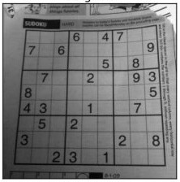
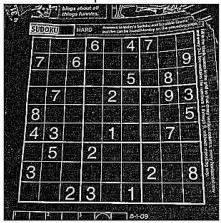
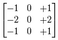
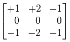
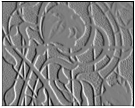
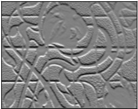

# Python OCR/Image Tools/Functions

## :package: Tools/Functions for Image Processing using PIL and/or OpenCV2
```python
from img-prep import *
```
### otsu_thresholding(img)
> otsu tresholding
##### prerequisites:
* gray image
```python
img = cv2.imread('image.png')
gray = toGray(img)
otsu_img = otsu_thresholding(gray)
```
### gaussian_otsu_thresholding(img)
> otsu tresholding with gaussian blur
##### prerequisites:
* gray image
```python
img = cv2.imread('image.png')
gray = toGray(img)
otsu_img = gaussian_otsu_thresholding(gray)
```
### global_thresholding(img)
> normal thresholding
##### prerequisites:
* gray image
```python
img = cv2.imread('image.png')
gray = toGray(img)
final_img = global_thresholding(gray)
```
### bw_image(img)
> make image black & white (Binary)
##### prerequisites:
* gray image
```python
img = cv2.imread('image.png')
gray = toGray(img)
final_img = bw_image(gray)
```
### auto_edge_detection(img, sigma=0.33)
> edge detecting with auto lower and upper threshold detection.
sigma=0.33 is basicaly best setup for most images.
##### prerequisites:
* gray image
* slightly blurred
```python
img = cv2.imread('image.png')
gray = toGray(img)
blurred = blur(gray)
final_img = edge_detection(blurred)
```
### wide_edge_detection(img)
> edge detecting using wide threshold
##### prerequisites:
* gray image
* slightly blurred
```python
img = cv2.imread('image.png')
gray = toGray(img)
blurred = blur(gray)
final_img = wide_edge_detection(blurred)
```
### tight_edge_detection(img)
> edge detecting using tight threshold
##### prerequisites:
* gray image
* slightly blurred
```python
img = cv2.imread('image.png')
gray = toGray(img)
blurred = blur(gray)
final_img = tight_edge_detection(blurred)
```
### percentage_scale(img,percentage)
> scale image with given percentage  keeps aspect ratio
##### prerequisites:
* none
##### example, scales 50%
```python
img = cv2.imread('image.png')
scaled = percentage_scale(img, 50)
```
### convolution_2d(img)
> Convolves an image with a 5x5 kernel
##### prerequisites:
* none
```python
img = cv2.imread('image.png')
conv = convolution_2d(img)
```
### laplacian(img)
> Laplacian Edge detector
##### prerequisites:
* gray image
* slightly blurred
```python
img = cv2.imread('image.png')
gray = toGray(img)
blurred = blur(gray)
laplaced = laplacian(blurred)
```
### sobelX(img)
> Sobel Edge detector (X)
for better edge detection it uses 64Bit in filter and outputs 8Bits
##### prerequisites:
* none
```python
img = cv2.imread('image.png')
final_img = sobelX(img)
```
### sobelY(img)
> Sobel Edge detector (Y)
for better edge detection it uses 64Bit in filter and outputs 8Bits
##### prerequisites:
* none
```python
img = cv2.imread('image.png')
final_img = sobelY(img)
```
### showImg(img)
> Shows image using Qt
on Windows install Xming to use
##### prerequisites:
* none
```python
img = cv2.imread('image.png')
showImg(img)
```
### blur(img)
> Slightly blur image
##### prerequisites:
* none
```python
img = cv2.imread('image.png')
blurred = blur(img)
```
### toGray(img)
> Convert to grayscale
##### prerequisites:
* none
```python
img = cv2.imread('image.png')
gray = toGray(img)
```


## FAQ/Explanations

### Convolution
> Convolution is an operation between every part of an image and an operator (kernel) <br />**or**<br />convolution is simply an element-wise multiplication of two matrices followed by a sum.

### Kernel
> A kernel is essentially a fixed size array of numerical coefficeints
along with an anchor point in that array, which is tipically located at the center.<br>
The functions mostly use a 5x5 kernel using NumPy
```python
kernel = np.ones((5,5),np.float32)/25
```
> or 3x3 kernel defined in python lib

### Laplacian (Edge Detection)
> Laplacian edge detector uses only one kernel.
It calculates second order derivatives in a single pass
2nd order derivative, so it is extremely sensitive to noise

Original | Result
---------|---------
 | 

### Sobel (Edge Detection)
> Sobel edge detector is a gradient based method based on the first order derivatives.
It calculates the first derivatives of the image separately for the X and Y axes.
Sobel uses 2x 3x3 kernels
first order derivatives

Sobel Kernel X | Sobel Kernel Y
---------------|---------------
 | 


 | Original |
-|----------|-
 | | 


### Tools/Functions for OCR reading
